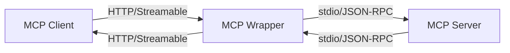

# MCP Wrapper - 1:1 Protocol Bridge

A Python-based wrapper that bridges stdio-based MCP (Model Context Protocol) servers to HTTP streamable-http protocol with **no indirection**. Each wrapper instance provides direct 1:1 protocol bridging for a single MCP server.

## ✨ Key Features

- **Pure Protocol Bridging**: Direct 1:1 mapping - no wrapper tools or indirection
- **FastMCP Integration**: Uses FastMCP's proven proxy capabilities for robust HTTP handling
- **Single Server Focus**: One MCP server per wrapper instance for simplicity and clarity
- **Early Error Detection**: Tests MCP server connectivity during startup, not on first request
- **Runtime Support**: Supports both `npx` (Node.js) and `uvx` (Python) MCP servers
- **Docker Ready**: Complete containerization with both Node.js and Python runtimes
- **Production Ready**: Comprehensive testing, logging, and error handling

## 🚀 Quick Start

### Installation

```bash
# Clone and setup
git clone <repository>
cd mcp-wrapper
uv sync
```

### Basic Usage

1. **Create Configuration** (`config.json`):
```json
{
  "server": {
    "command": "npx",
    "args": ["-y", "@modelcontextprotocol/server-sequential-thinking"]
  }
}
```

2. **Run the Wrapper**:
```bash
uv run python -m mcp_wrapper.main config.json --host 127.0.0.1 --port 8000
```

The wrapper will automatically test the connection to the MCP server during startup. If the server fails to start or respond, the wrapper will exit with a clear error message.

**CLI Options:**
- `--no-test-connection`: Skip the startup connection test (default: test enabled)
- `--host`: Host to bind to (default: 127.0.0.1)
- `--port`: Port to bind to (default: 8000)
- `--path`: Base path for MCP endpoints (default: /mcp)
- `--log-level`: Logging level (default: INFO)

3. **Access via HTTP**: The backend MCP server's tools, resources, and prompts are now available at `http://127.0.0.1:8000/mcp` using streamable-HTTP protocol.

## 📖 How It Works



The MCP wrapper:
1. **Spawns** the configured MCP server as a subprocess
2. **Tests** the connection during startup (can be disabled with `--no-test-connection`)
3. **Bridges** HTTP streamable requests to stdio JSON-RPC
4. **Forwards** all backend capabilities directly (tools, resources, prompts)
5. **Returns** responses via HTTP streamable protocol

**No wrapper tools or indirection** - everything from the backend is exposed directly.

## ⚡ Startup and Error Handling

### Early Error Detection

The wrapper tests the MCP server connection **during startup** (not on first request) to provide:

- **Fast Failure**: Immediate feedback if the MCP server can't start
- **Clear Errors**: Detailed error messages with the failing command
- **Production Safety**: No broken services accepting traffic

**Example startup with connection test:**
```bash
$ uv run mcp-wrapper config.json
2025-08-06 14:01:19,002 - mcp_wrapper.server - INFO - Setting up proxy for MCP server: npx
2025-08-06 14:01:19,020 - mcp_wrapper.server - INFO - Testing MCP server connection...
2025-08-06 14:01:19,020 - mcp_wrapper.server - INFO - Starting MCP server: npx -y @modelcontextprotocol/server-memory
2025-08-06 14:01:20,081 - mcp_wrapper.server - INFO - MCP server connection test successful
2025-08-06 14:01:20,081 - mcp_wrapper.server - INFO - Starting MCP wrapper server on 127.0.0.1:8000/mcp
```

**Example startup failure:**
```bash
$ uv run mcp-wrapper bad-config.json
2025-08-06 14:02:25,540 - mcp_wrapper.server - INFO - Starting MCP server: nonexistent-command --invalid
2025-08-06 14:02:25,584 - mcp_wrapper.server - ERROR - Failed to connect to MCP server during startup: [Errno 2] No such file or directory: 'nonexistent-command'
2025-08-06 14:02:25,585 - mcp_wrapper.server - ERROR - Command: nonexistent-command --invalid
2025-08-06 14:02:25,585 - mcp_wrapper.main - ERROR - Server failed: MCP server startup failed
```

### Skip Connection Test

For development or specific deployment scenarios, you can skip the startup test:

```bash
uv run mcp-wrapper config.json --no-test-connection
```

This will start the wrapper immediately without testing the MCP server connection first.

## 🛠️ Configuration Examples

### Node.js Server (NPX)
```json
{
  "server": {
    "command": "npx",
    "args": ["-y", "@modelcontextprotocol/server-filesystem", "/tmp"]
  }
}
```

### Python Server (UVX)
```json
{
  "server": {
    "command": "uvx",
    "args": ["mcp-server-git", "--repository", "."],
    "env": {
      "GIT_AUTHOR_NAME": "MCP Wrapper",
      "GIT_AUTHOR_EMAIL": "wrapper@example.com"
    },
    "cwd": "/path/to/repo"
  }
}
```

### Full Configuration Options
```json
{
  "server": {
    "command": "npx",                    // Command to run
    "args": ["-y", "package-name"],      // Command arguments
    "env": {                             // Environment variables
      "API_KEY": "secret",
      "DEBUG": "true"
    },
    "cwd": "/working/directory"          // Working directory
  }
}
```

## 🏗️ Architecture

### Components

- **`models.py`**: Pydantic data models for configuration validation
- **`config.py`**: Configuration loading and management
- **`server.py`**: FastMCP proxy server implementation
- **`main.py`**: CLI entry point

### Design Principles

1. **Simplicity**: One server per wrapper - clear and focused
2. **Direct Mapping**: No abstraction layers or wrapper tools
3. **Production Ready**: Proper error handling, logging, testing
4. **Standards Compliance**: Pure MCP protocol implementation

## 🐳 Docker Deployment

### Build and Run
```bash
# Build image
docker build -t mcp-wrapper .

# Run with config
docker run -p 8000:8000 -v $(pwd)/config.json:/app/config.json mcp-wrapper

# Or use docker-compose
docker-compose up --build
```

### Docker Compose (with nginx)
```yaml
services:
  mcp-wrapper:
    build: .
    ports:
      - "8000:8000"
    volumes:
      - ./config.json:/app/config.json
  
  nginx:
    image: nginx:alpine
    ports:
      - "80:80"
    volumes:
      - ./nginx.conf:/etc/nginx/nginx.conf
    depends_on:
      - mcp-wrapper
```

## 🧪 Testing

```bash
# Run all tests
uv run pytest

# Run with coverage
uv run pytest --cov=mcp_wrapper

# Run specific test category
uv run pytest tests/test_config.py -v
```

## 📚 Usage Examples

### Programmatic Usage
```python
import asyncio
from mcp_wrapper import run_server, WrapperSettings

async def main():
    settings = WrapperSettings(
        host="0.0.0.0", 
        port=8080, 
        path="/api/mcp"
    )
    await run_server("config.json", settings)

asyncio.run(main())
```

### Client Connection
```python
# Connect to the wrapper from any MCP client
from fastmcp import Client

async with Client("http://localhost:8000/mcp") as client:
    # All backend tools are available directly
    result = await client.call_tool("backend_tool", {"param": "value"})
    
    # All backend resources are accessible
    content = await client.read_resource("backend://resource/path")
```

## 🔧 Development

### Setup Development Environment
```bash
# Install dependencies
uv sync

# Run tests
uv run pytest

# Start development server
uv run python -m mcp_wrapper.main config.json --log-level DEBUG
```

### Deployment Script
```bash
# Available commands
./deploy.sh install    # Install dependencies
./deploy.sh test       # Run tests
./deploy.sh dev        # Start dev server
./deploy.sh docker     # Build and run Docker
```

## 📋 Requirements Met

This implementation fulfills all requirements from COPILOT.md:

- ✅ **Protocol Bridging**: stdio ↔ HTTP streamable conversion
- ✅ **No Indirection**: Direct 1:1 protocol mapping
- ✅ **Runtime Support**: Both `npx` and `uvx` supported
- ✅ **FastMCP Integration**: Uses FastMCP for proven HTTP handling
- ✅ **Docker Ready**: Complete containerization
- ✅ **uv Package Management**: No pip usage
- ✅ **Simple & Clean**: Clear separation of concerns
- ✅ **Well Tested**: Comprehensive test suite

## 🔄 Migration from Multi-Server

This version focuses on **1:1 protocol bridging** instead of multi-server management. Benefits:

- **Cleaner Architecture**: Simpler, more focused design
- **Direct Protocol Mapping**: No wrapper abstractions
- **Better Performance**: Less overhead, direct forwarding
- **Easier Debugging**: Clear request/response flow
- **True MCP Compliance**: Backend capabilities exposed as-is

For multiple servers, run multiple wrapper instances on different ports.

## 📄 License

MIT License - see LICENSE file for details.

## 🤝 Contributing

1. Fork the repository
2. Create a feature branch
3. Add tests for new functionality
4. Ensure all tests pass
5. Submit a pull request

## 📞 Support

- **Documentation**: This README and inline code comments
- **Issues**: GitHub issue tracker
- **FastMCP Docs**: https://gofastmcp.com
